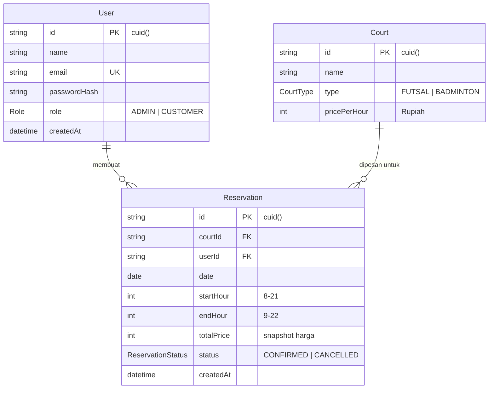

# ERD dan SQL Script
## Sistem Reservasi Lapangan — SM Sport Center

---

## 1. Entity Relationship Diagram (ERD)



## 2. Keputusan Desain Database

| Keputusan | Alasan |
|---|---|
| Satu tabel `User` dengan field `role` | Tidak perlu tabel terpisah untuk admin dan customer — strukturnya sama |
| Slot jam menggunakan integer (8–22) | Query overlap jadi sederhana (`startHour < endHour AND endHour > startHour`), tidak perlu timestamp |
| `totalPrice` disimpan sebagai snapshot | Harga per jam (`pricePerHour`) bisa berubah di kemudian hari, laporan historis harus tetap akurat |
| Index `(courtId, date, status)` | Query ketersediaan selalu filter tiga kolom ini — index komposit mempercepat query utama |
| `status` enum (`CONFIRMED`/`CANCELLED`) | Soft delete — data reservasi yang dibatalkan tetap tersimpan untuk laporan |

## 3. SQL Script (Migration)

SQL di bawah dihasilkan dari Prisma schema melalui `npx prisma migrate dev`.

```sql
-- CreateEnum
CREATE TYPE "Role" AS ENUM ('ADMIN', 'CUSTOMER');

-- CreateEnum
CREATE TYPE "CourtType" AS ENUM ('FUTSAL', 'BADMINTON');

-- CreateEnum
CREATE TYPE "ReservationStatus" AS ENUM ('CONFIRMED', 'CANCELLED');

-- CreateTable
CREATE TABLE "User" (
    "id" TEXT NOT NULL,
    "name" TEXT NOT NULL,
    "email" TEXT NOT NULL,
    "passwordHash" TEXT NOT NULL,
    "role" "Role" NOT NULL DEFAULT 'CUSTOMER',
    "createdAt" TIMESTAMP(3) NOT NULL DEFAULT CURRENT_TIMESTAMP,

    CONSTRAINT "User_pkey" PRIMARY KEY ("id")
);

-- CreateTable
CREATE TABLE "Court" (
    "id" TEXT NOT NULL,
    "name" TEXT NOT NULL,
    "type" "CourtType" NOT NULL,
    "pricePerHour" INTEGER NOT NULL,

    CONSTRAINT "Court_pkey" PRIMARY KEY ("id")
);

-- CreateTable
CREATE TABLE "Reservation" (
    "id" TEXT NOT NULL,
    "courtId" TEXT NOT NULL,
    "userId" TEXT NOT NULL,
    "date" DATE NOT NULL,
    "startHour" INTEGER NOT NULL,
    "endHour" INTEGER NOT NULL,
    "totalPrice" INTEGER NOT NULL,
    "status" "ReservationStatus" NOT NULL DEFAULT 'CONFIRMED',
    "createdAt" TIMESTAMP(3) NOT NULL DEFAULT CURRENT_TIMESTAMP,

    CONSTRAINT "Reservation_pkey" PRIMARY KEY ("id")
);

-- CreateIndex
CREATE UNIQUE INDEX "User_email_key" ON "User"("email");

-- CreateIndex
CREATE INDEX "Reservation_courtId_date_status_idx"
    ON "Reservation"("courtId", "date", "status");

-- AddForeignKey
ALTER TABLE "Reservation"
    ADD CONSTRAINT "Reservation_courtId_fkey"
    FOREIGN KEY ("courtId") REFERENCES "Court"("id")
    ON DELETE RESTRICT ON UPDATE CASCADE;

-- AddForeignKey
ALTER TABLE "Reservation"
    ADD CONSTRAINT "Reservation_userId_fkey"
    FOREIGN KEY ("userId") REFERENCES "User"("id")
    ON DELETE RESTRICT ON UPDATE CASCADE;
```

## 4. Seed Data

| Tabel | Data |
|---|---|
| Court | Futsal A (Rp200.000/jam), Futsal B (Rp200.000/jam), Badminton 1 (Rp75.000/jam), Badminton 2 (Rp75.000/jam), Badminton 3 (Rp100.000/jam) |
| User (Admin) | Admin SM Sport Center — admin@smsportcenter.com |
| User (Customer) | Budi Santoso, Siti Rahayu, Andi Wijaya, Dewi Lestari, Rudi Hermawan |
| Reservation | 5 reservasi contoh (4 CONFIRMED, 1 CANCELLED) |
