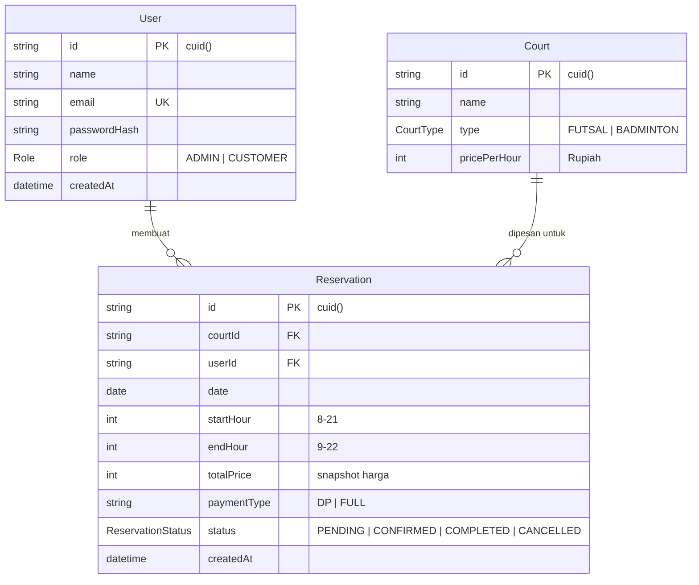

# ERD dan Skema Database
## Panduan Struktur Data untuk Sistem Reservasi SM Sport Center

Dokumen ini saya susun bagi penguji (asesor) maupun pengembang lain untuk memahami rancangan *database* yang saya buat untuk sistem SM Sport Center. Di sini, Anda akan melihat tidak hanya *apa* saja tabel yang saya miliki, melainkan juga penjelasan *mengapa* saya memilih desain dan tipe data tersebut.

---

## 1. Visualisasi ERD (*Entity Relationship Diagram*)
Diagram di bawah ini menggambarkan alur relasi antar entitas inti. Pembacaan singkatnya: **Satu User** bisa membuat banyak **Reservation** pada satu **Court** (Lapangan).


```mermaid
erDiagram
    User {
        string id PK "cuid()"
        string name
        string email UK
        string passwordHash
        Role role "ADMIN | CUSTOMER"
        datetime createdAt
    }

    Court {
        string id PK "cuid()"
        string name
        CourtType type "FUTSAL | BADMINTON"
        int pricePerHour "Rupiah"
    }

    Reservation {
        string id PK "cuid()"
        string courtId FK
        string userId FK
        date date
        int startHour "8-21"
        int endHour "9-22"
        int totalPrice "snapshot harga"
        string paymentType "DP | FULL"
        ReservationStatus status "PENDING | CONFIRMED | COMPLETED | CANCELLED"
        datetime createdAt
    }

    User ||--o{ Reservation : "membuat"
    Court ||--o{ Reservation : "dipesan untuk"
```

---

## 2. Kamus Data (Spesifikasi Tabel)

Bagian ini merinci struktur fisik dari masing-masing tabel di dalam database, yang menjadi acuan standar (Kamus Data) bagi pengembang.

### 2.1. Tabel `User`
Menyimpan data otentikasi dan profil pengguna.
| Nama Kolom | Tipe Data (PostgreSQL) | Constraint | Keterangan |
|---|---|---|---|
| `id` | `TEXT` | `PRIMARY KEY` | Dibuat otomatis menggunakan format CUID. |
| `name` | `TEXT` | `NOT NULL` | Nama lengkap pengguna. |
| `email` | `TEXT` | `NOT NULL, UNIQUE` | Alamat email (digunakan untuk login). |
| `passwordHash`| `TEXT` | `NOT NULL` | Kata sandi yang sudah dienkripsi (Bcrypt). |
| `role` | `ENUM ('ADMIN', 'CUSTOMER')` | `NOT NULL, DEFAULT 'CUSTOMER'` | Hak akses pengguna. |
| `createdAt` | `TIMESTAMP(3)` | `NOT NULL, DEFAULT NOW()` | Waktu akun didaftarkan. |

### 2.2. Tabel `Court`
Menyimpan data master lapangan yang disewakan.
| Nama Kolom | Tipe Data (PostgreSQL) | Constraint | Keterangan |
|---|---|---|---|
| `id` | `TEXT` | `PRIMARY KEY` | Dibuat otomatis menggunakan format CUID. |
| `name` | `TEXT` | `NOT NULL` | Nama/Nomor lapangan (misal: "Futsal A"). |
| `type` | `ENUM ('FUTSAL', 'BADMINTON')`| `NOT NULL` | Kategori jenis lapangan. |
| `pricePerHour`| `INTEGER` | `NOT NULL` | Harga sewa per jam (dalam Rupiah). |

### 2.3. Tabel `Reservation`
Menyimpan data transaksi pemesanan lapangan.
| Nama Kolom | Tipe Data (PostgreSQL) | Constraint | Keterangan |
|---|---|---|---|
| `id` | `TEXT` | `PRIMARY KEY` | Dibuat otomatis menggunakan format CUID. |
| `courtId` | `TEXT` | `NOT NULL, FOREIGN KEY` | Merujuk ke `Court.id`. |
| `userId` | `TEXT` | `NOT NULL, FOREIGN KEY` | Merujuk ke `User.id` (Pemesan). |
| `date` | `DATE` | `NOT NULL` | Tanggal pemesanan (tanpa zona waktu). |
| `startHour` | `INTEGER` | `NOT NULL` | Jam mulai (format 24 jam, misal: 14). |
| `endHour` | `INTEGER` | `NOT NULL` | Jam selesai (format 24 jam, misal: 16). |
| `totalPrice` | `INTEGER` | `NOT NULL` | Total harga (durasi × harga per jam saat dipesan). |
| `paymentType` | `TEXT` | `NOT NULL, DEFAULT 'DP'` | Jenis bayar: "DP" (50%) atau "FULL" (100%). |
| `status` | `ENUM ('PENDING', 'CONFIRMED', 'COMPLETED', 'CANCELLED')` | `NOT NULL, DEFAULT 'PENDING'` | Status alur reservasi. |
| `createdAt` | `TIMESTAMP(3)` | `NOT NULL, DEFAULT NOW()` | Waktu pesanan dibuat. |
## 3. Keputusan Desain Database

| Keputusan | Alasan |
|---|---|
| Satu tabel `User` dengan field `role` | Tidak perlu tabel terpisah untuk admin dan customer — strukturnya sama |
| Slot jam menggunakan integer (8–22) | Query overlap jadi sederhana (`startHour < endHour AND endHour > startHour`), tidak perlu timestamp |
| `totalPrice` disimpan sebagai snapshot | Harga per jam (`pricePerHour`) bisa berubah di kemudian hari, laporan historis harus tetap akurat |
| `paymentType` | Meyimpan preferensi pembayaran pelanggan: "DP" (50%) atau "FULL" (100%). |
| Index `(courtId, date, status)` | Query ketersediaan selalu filter tiga kolom ini — index komposit mempercepat query utama |
| `status` enum | `PENDING` (Tunggu bayar QRIS), `CONFIRMED` (Sudah bayar/DP), `COMPLETED` (Sudah lunas & selesai), `CANCELLED` (Batal — DP hangus, slot dibuka; FULL tetap mengunci slot). Soft delete. |

## 4. SQL Script (Migration)

SQL di bawah dihasilkan dari Prisma schema melalui `npx prisma migrate dev`.

```sql
-- CreateEnum
CREATE TYPE "Role" AS ENUM ('ADMIN', 'CUSTOMER');

-- CreateEnum
CREATE TYPE "CourtType" AS ENUM ('FUTSAL', 'BADMINTON');

-- CreateEnum
CREATE TYPE "ReservationStatus" AS ENUM ('PENDING', 'CONFIRMED', 'COMPLETED', 'CANCELLED');

-- CreateTable
CREATE TABLE "User" (
    "id" TEXT NOT NULL,
    "name" TEXT NOT NULL,
    "email" TEXT NOT NULL,
    "passwordHash" TEXT NOT NULL,
    "role" "Role" NOT NULL DEFAULT 'CUSTOMER',
    "createdAt" TIMESTAMP(3) NOT NULL DEFAULT CURRENT_TIMESTAMP,

    CONSTRAINT "User_pkey" PRIMARY KEY ("id")
);

-- CreateTable
CREATE TABLE "Court" (
    "id" TEXT NOT NULL,
    "name" TEXT NOT NULL,
    "type" "CourtType" NOT NULL,
    "pricePerHour" INTEGER NOT NULL,

    CONSTRAINT "Court_pkey" PRIMARY KEY ("id")
);

-- CreateTable
CREATE TABLE "Reservation" (
    "id" TEXT NOT NULL,
    "courtId" TEXT NOT NULL,
    "userId" TEXT NOT NULL,
    "date" DATE NOT NULL,
    "startHour" INTEGER NOT NULL,
    "endHour" INTEGER NOT NULL,
    "totalPrice" INTEGER NOT NULL,
    "paymentType" TEXT NOT NULL DEFAULT 'DP',
    "status" "ReservationStatus" NOT NULL DEFAULT 'PENDING',
    "createdAt" TIMESTAMP(3) NOT NULL DEFAULT CURRENT_TIMESTAMP,

    CONSTRAINT "Reservation_pkey" PRIMARY KEY ("id")
);

-- CreateIndex
CREATE UNIQUE INDEX "User_email_key" ON "User"("email");

-- CreateIndex
CREATE INDEX "Reservation_courtId_date_status_idx"
    ON "Reservation"("courtId", "date", "status");

-- AddForeignKey
ALTER TABLE "Reservation"
    ADD CONSTRAINT "Reservation_courtId_fkey"
    FOREIGN KEY ("courtId") REFERENCES "Court"("id")
    ON DELETE RESTRICT ON UPDATE CASCADE;

-- AddForeignKey
ALTER TABLE "Reservation"
    ADD CONSTRAINT "Reservation_userId_fkey"
    FOREIGN KEY ("userId") REFERENCES "User"("id")
    ON DELETE RESTRICT ON UPDATE CASCADE;
```

## 5. Seed Data

| Tabel | Data |
|---|---|
| Court | Futsal A (Rp200.000/jam), Futsal B (Rp200.000/jam), Badminton 1 (Rp75.000/jam), Badminton 2 (Rp75.000/jam), Badminton 3 (Rp100.000/jam) |
| User (Admin) | Admin SM Sport Center — admin@smsportcenter.com |
| User (Customer) | Budi Santoso, Siti Rahayu, Andi Wijaya, Dewi Lestari, Rudi Hermawan |
| Reservation | 5 reservasi contoh (4 CONFIRMED, 1 CANCELLED) |
